************
Installation
************

This guide will help you set up a local installation of this database. We will also provide instructions on how to host
this project as a website on AWS Elastic Beanstalk.

Local Installation
==================

Required Software
-----------------

Setting up a local installation of the database for personal use is relatively straightforward. You will need the
following installed on your machine:

    * Python3
    * PostgreSQL
    * Git

Python3
+++++++

If you are working with Linux and MacOS, you probably already have Python3 installed.
`Here <https://realpython.com/installing-python/>`_ is a (as of this writing) current guide on how to install Python3.
You may also choose to install Python3 with the `Anaconda Python Distribution
<https://www.anaconda.com/products/individual>`_ (recommended for beginners interested in starting with data science).

PostgreSQL
++++++++++

General installation instructions for PostgreSQL can be found `here
<https://www.postgresql.org/docs/current/installation.html>`_.

For Ubuntu::

    sudo apt install postgresql postgresql-contrib

For MacOS with homebrew (instructions `here <https://formulae.brew.sh/cask/postgres#default>`_)::

    brew cask install postgres

Plasmid Database Setup
----------------------

1. Obtaining a Copy of the Web Application
++++++++++++++++++++++++++++++++++++++++++

To run the plasmid web application, we will need to obtain a copy of the code from Github.

From the command line::

    git clone https://github.com/jaaamessszzz/PlasmidWebApp.git

Installation instructions for the git command line tool can be found `here <https://github.com/git-guides/install-git>`_.
You can also download the application as a zip file from the `Plasmid Web App Github repository
<https://github.com/jaaamessszzz/PlasmidWebApp>`_ and extract the archive.

Change directories into the PlasmidWebApp directory.

2. Setup the PostgreSQL database
++++++++++++++++++++++++++++++++

From the command line, start postgreSQL as the postgreSQL superuser::

    sudo -u postgres psql postgres

As the postgreSQL superuser, we will be creating a default user and database for the plasmid web application to populate.
The values that the plasmid web application expects can be found in `plasmiddb/plasmiddb/settings.py`::

    DATABASES = {
        'default': {
            'ENGINE': 'django.db.backends.postgresql_psycopg2',
            'NAME': 'plasmid_database',
            'USER': 'jaaamessszzz',
            'PASSWORD': 'herpderp~',
            'HOST': 'localhost',
            'PORT': '',
        }
    }

First we will create a new user::

    createuser --interactive --pwprompt;

Follow the prompts and enter the name (aka role) and password as in `settings.py`. You may (and probably should) change
the `NAME` and `USER` values in `settings.py`, just substitute in you own.

After creating the new user, create a new database for the web application::

    createdb plasmid_database;

Again, you can name the database whatever you want, just make sure to update `NAME` in your `settings.py`.

Finally, let's make sure that our new user has full permissions to modify data in the new database::

    GRANT PERMISSIONS ON DATABASE plasmid_database TO jaaamessszzz;

3. Running the Web Application Locally
++++++++++++++++++++++++++++++++++++++

Before we run the application for the first time, we need to create the models in the PostgreSQL database that the web
application will use to store and retrieve plasmid data::

    python3 plasmiddb/manage.py migrate

The development sever can be started with the following command::

    python3 plasmiddb/manage.py runserver

You may start using the application be navigating to the url specified (typically `http://127.0.0.1:8000/`) in your
preferred web browser.

AWS Elastic Beanstalk
=====================

Elastic Beanstalk is a service provided by Amazon Web Services to easily host and deploy web applications. We will use
this service to host the plasmid database as a website that can be accessed anywhere.

I learned how to do this for the first time using `this guide by Real Python
<https://realpython.com/deploying-a-django-app-and-postgresql-to-aws-elastic-beanstalk/>`_. The AWS command line tool is
highly recommended and makes deployment very simple. However, it is possible to accomplish deployment using only the
web browser.

Required Software
-----------------

All required software will be installed by AWS on AWS, so there is no extra preparation needed!

Set up an AWS Account
---------------------

Create an AWS account `here <https://portal.aws.amazon.com/billing/signup#/start>`_. Hosting the plasmid web application
on AWS will accrue charges, but AWS (at the moment) includes a full year of free access for the tools we will be using
to host the web application.

.. _Prepare Source:

Preparing the Web Application Source Code
-----------------------------------------

To upload the web application source code to AWS, we will require a zip file containing the source code. Unfortunately,
we will need to slightly modify the source from Github so that it is packaged correctly for Elastic Beanstalk.

Navigate to the unzipped web application source code directory in the command line. You should see the following when
using the `ls -lha` command:

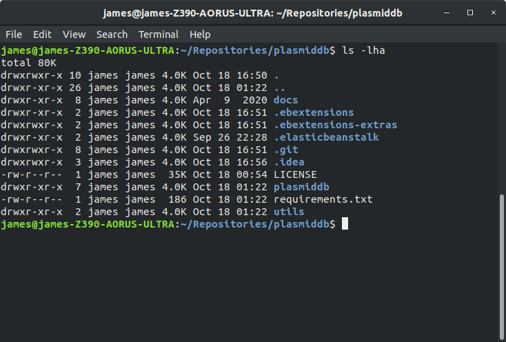

From here, use the following command to package the contents of this directory into a zip archive:
`zip ../plasmidapplication.zip -r * .[^.]*`

This should produce a zip archive one directory up with the following contents:

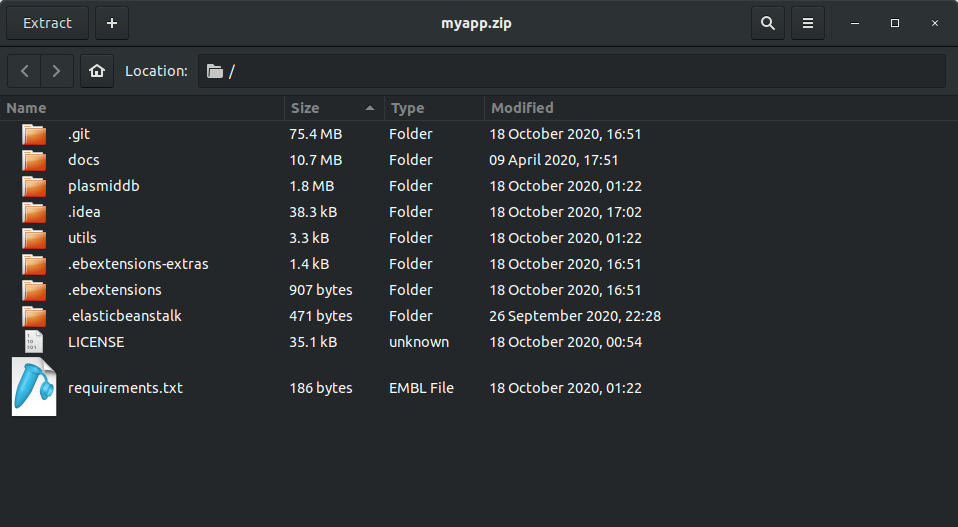

This zip archive is ready to be uploaded to Elastic Beanstalk! Official AWS documentation for creating this zip archive
can be found `here <https://docs.aws.amazon.com/elasticbeanstalk/latest/dg/applications-sourcebundle.html>`_.

Uploading the Web Application to AWS
------------------------------------

After logging in for the first time, you should arrive at this landing page:

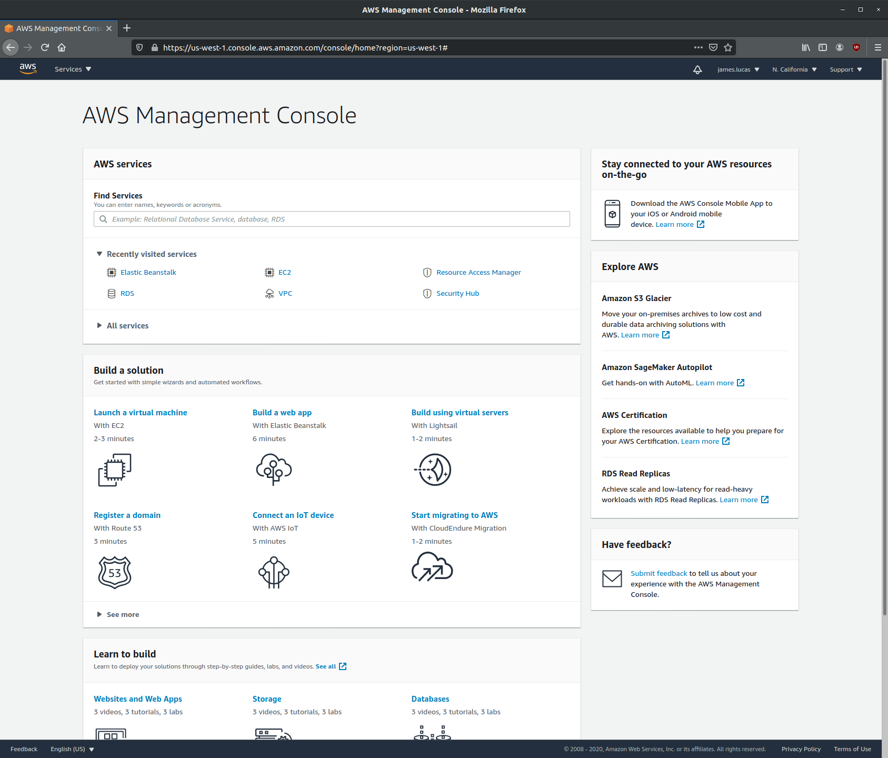

Click on the `Services` tab in the top left and select `Elastic Beanstalk` under the Compute service menu. You will
arrive at the Elastic Beanstalk landing page:

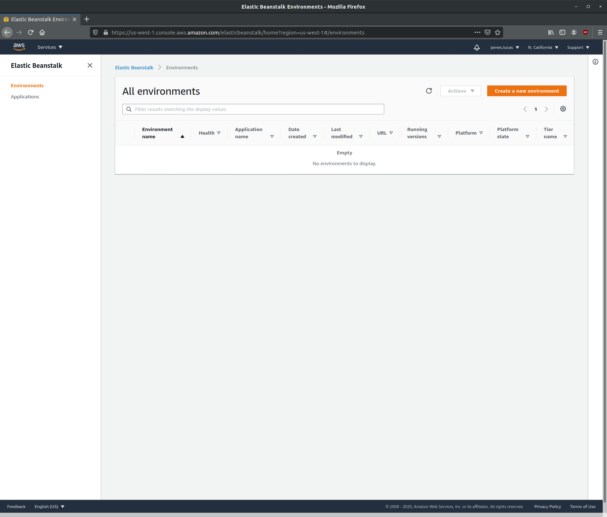

.. warning::
    AWS services are divided by regions (upper right dropdown). For instance, the region where I am developing this
    tutorial is `N. California (us-west-1)`. Remember which region you start your server in! Applications will only be
    visible in the Elastic Beanstalk management page from the region where the environments are started.

First, we will need to create a new environment to host the web application. Click on `Create a new environment` at the
top right of the Elastic Beanstalk management page.
w to do this for the first time using this guide by Real Python. The AWS command line tool is highly recommended and makes deployment very simple. Howev
We want to start a web server environment:

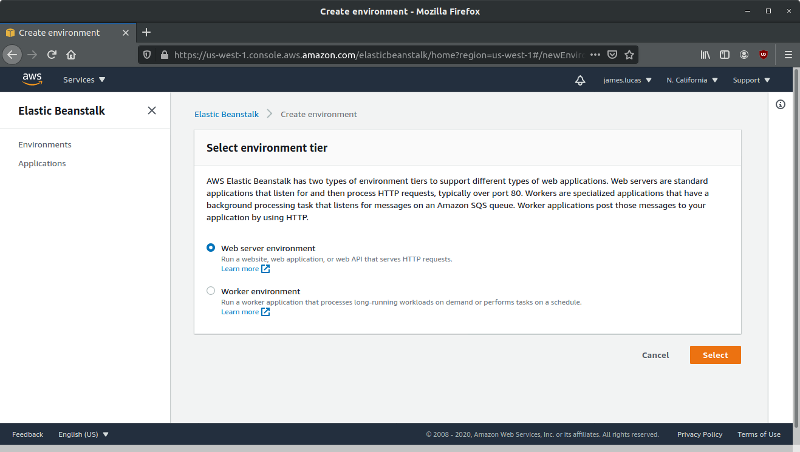

Click select. Next page has several fields and options that we need to fill out for our environment:

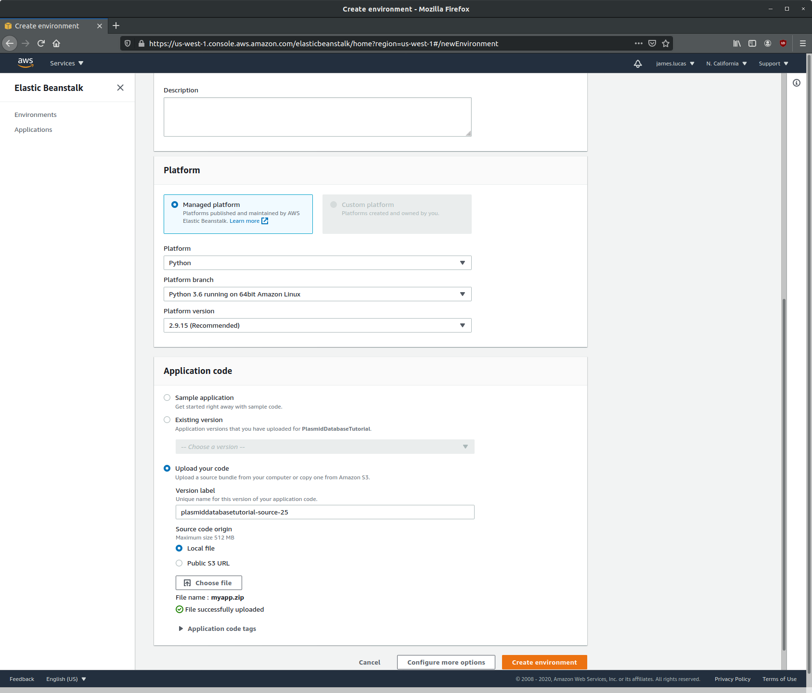

Fill out the following fields:

    * Application name: Name your applcation whatever you'd like. Here I used `PlasmidDatabaseTutorial`
    * Platform: Use a Managed platform and select `Python` from the `Platform` dropdown menu. Select `Python 3.6 running
      on 64bit Amazon Linux` for `Platform branch` and `Platform version` 2.9.15.
    * Application code: Select `Upload your code` and upload the zip archive we prepared (:ref:`Prepare Source`).

After the archive has been uploaded, click on `Create environment`. You will be taken to this page where AWS will report
on the status of creating your new environment:

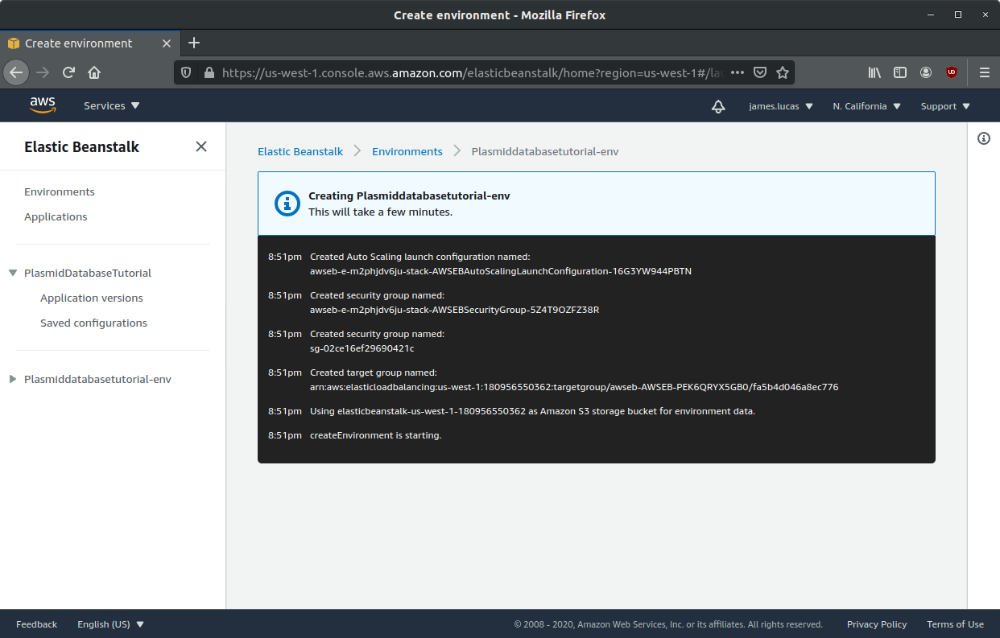

This will take a few minutes to complete. If "successful", you will be taken back to the Elastic Beanstalk management
console with a new entry for our newly created web application:

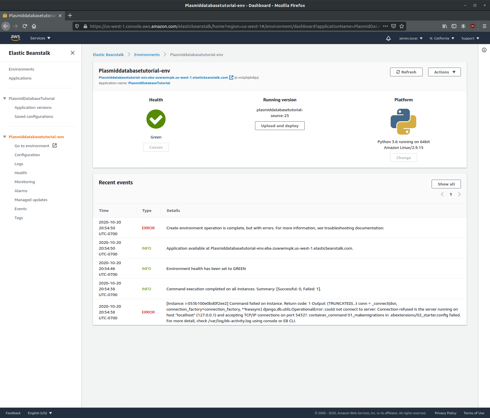

You will see some errors that looks like this:

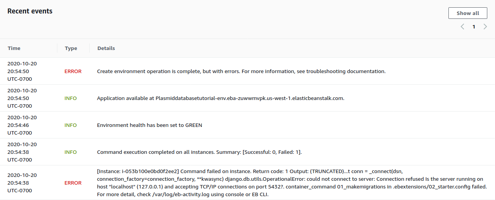

This is expected!!! We created an environment for the web application to run, but we still haven't configured the
database. Let's do that now. From the Elastic Beanstalk sidebar, click on `Configuration`.

This will take you to the Configuration overview page. Scroll all the way to the bottom to find the `Database` row.
Click `Edit`.

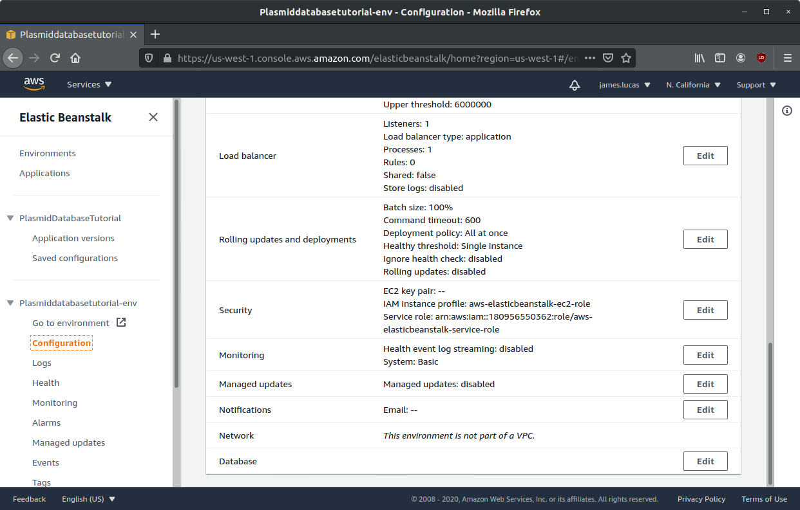

We will be using the AWS RDS service to host our PostgreSQL database. Select the following options:

    * **Engine**: Postgres. Select the latest PostgreSQL 9 version available (9.6.19)
    * **Instance class**: Keep the default (db.t2.micro)
    * **Storage**: This value can be anything, but keep in mind that the database will only be holding text information
      (files are stored elsewhere). 5GB is enough space for hundreds of thousands of plasmids!
    * **Username and Password**: Enter any username and password. The values here do not have to match the values set in
      `plasmiddb/plasmiddb/settings.py`

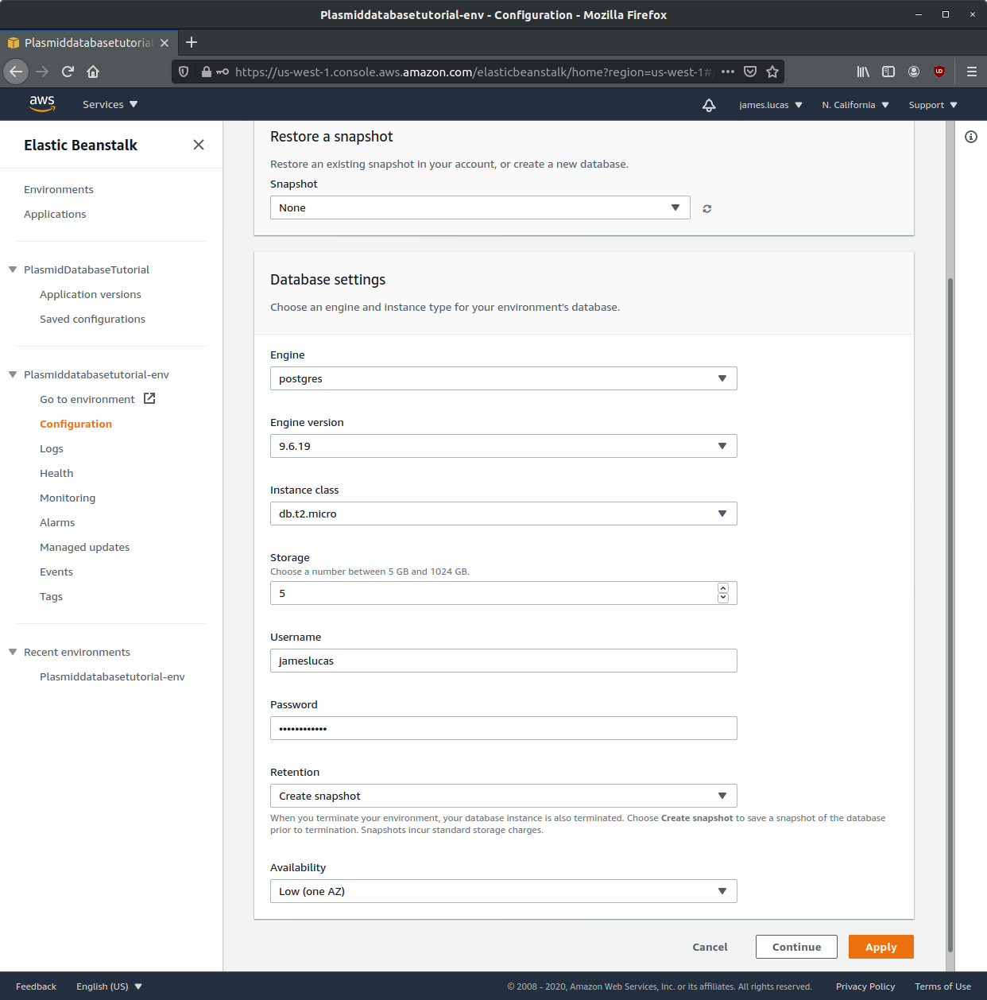

Click `Apply`. You will be taken back to the Elastic Beanstalk management page where your environment will be updated
with the latest changes. This will take >5 minutes to complete.

After the update is complete, click on `Go to environment` in the Elastic Beanstalk sidebar. This will take us to the
web site we have created! You can also click on the super long URL under your environment name on the management panel.

You will see something that looks like this:

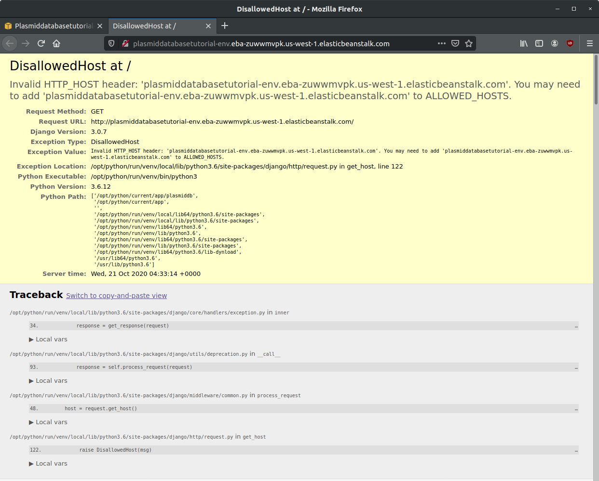

.. note::
    If you see a 404 error, this can be easily fixed by rebuilding you environment (Actions > Rebuild Environment)

Good news: this means we have set up the web application for hosting on AWS! Bad news: there are still more settings we
need to configure.

`settings.py` Configuration
---------------------------

We can configure several settings for our application in the application's `settings.py` file. The `settings.py` file
for the web application can be found at `plasmiddb/plasmiddb/settings.py`. In order for the web application to function
correctly on AWS, there are several settings we need to modify in `settings.py`.

We will be modifying the following values:

    * **SECRET_KEY** (line 23): obviously, this value needs to be secret! It is very important for your site's
      `security <https://docs.djangoproject.com/en/3.1/topics/signing/>`_. Change this to a unique value (>50 random
      characters).
    * **DEBUG** (line 26): Set this to `False`. Leaving debug on will will generate the long error messages like the one
      when first visiting the unconfigured website and provide a lot of revealing information about how your application
      is configured.
    * **ALLOWED_HOSTS** (line 28): This is the value the web application was complaining about when first visiting the
      web application. This variable needs to be populated with the hosts/domains that the web application will be
      served on. Update `ALLOWED_HOSTS` so that the list includes the host header or URL the debug page was complaining
      about. For example, your ALLOWED_HOSTS should look like::

        ALLOWED_HOSTS = ['plasmiddatabasetutorial-env.eba-zuwwmvpk.us-west-1.elasticbeanstalk.com']

      If you are new to Python, remember strings need to be encapsulated in quotes. You will add any new URLs to this
      list (e.g. if you register a custom domain name).

That's it! Upload this new version to Elastic Beanstalk and you should see this:

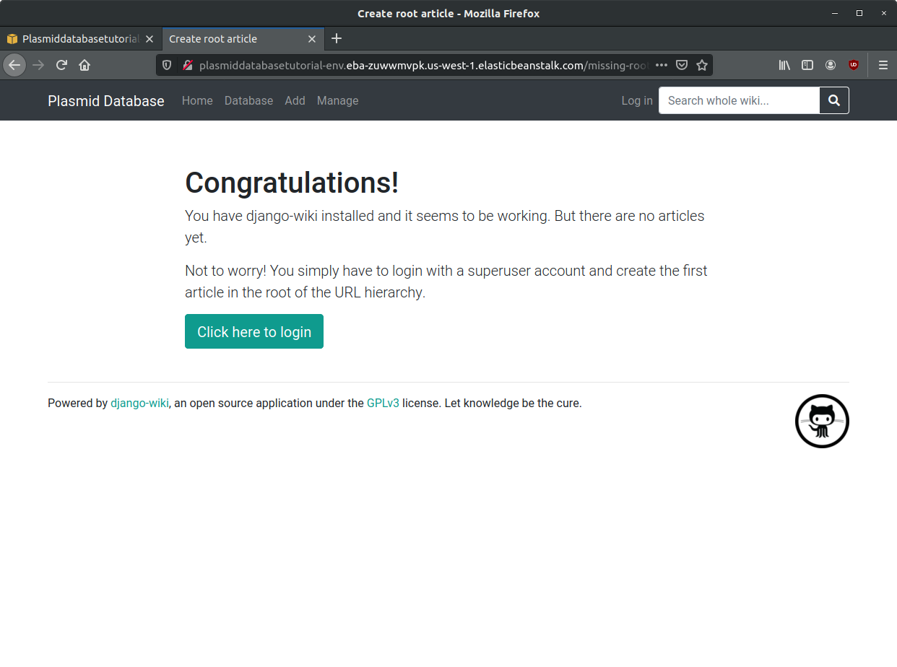

Awesome! You're all set. Continue to the Tutorial to learn how to start using this application!
